# Debugging With Foxglove

Foxglove is a powerful observability platform designed to work seamlessly with ROS-based systems.
Whether you’re using ROS 1 or ROS 2, Foxglove provides intuitive interfaces for visualizing your robot’s real-time data.

## Benefits of using Foxglove with ROS.

* Seamless ROS integration: Native compatibility with ROS 1 and ROS 2.
* No-code visualization: Out-of-the-box tools reduce the need for custom RViz plugins or dashboard UIs.
* Cross-platform support: Run in browser or desktop app.
* Remote collaboration: Share sessions and insights with distributed teams.

## Steps

### Step 1:

Append the topic name that you want to see (e.g. "/debug_images/vector_image") to the default_value of topic_whitelist in **electrode/src/electrode/launch/electrode.launch.py** as shown below:

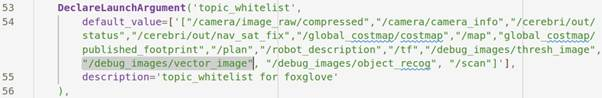

### Step 2:

Open a **new terminal** and run the following command after starting the simulation (which is done using the command: **ros2 launch b3rb_gz_bringup sil.launch.py world:=Raceway_1**)
```
ros2 launch electrode electrode.launch.py sim:=True
```

* Foxglove window will open.
* Inside Foxglove, open connection to the url:
    ```
    ws://localhost:8765
    ```

### Step 3

- **For Camera Images:**

    * Create a new Image panel as shown in the image below:

        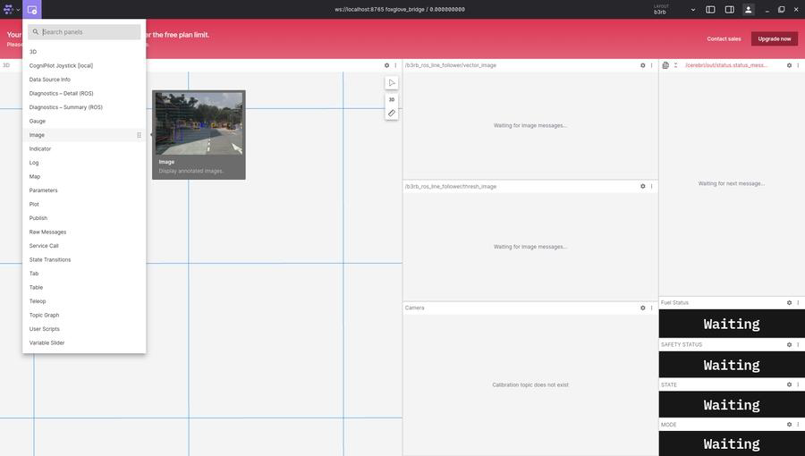
    
    * Then click on panel settings and select the topic for which you created a publisher in the "**prerequisites**" section.

        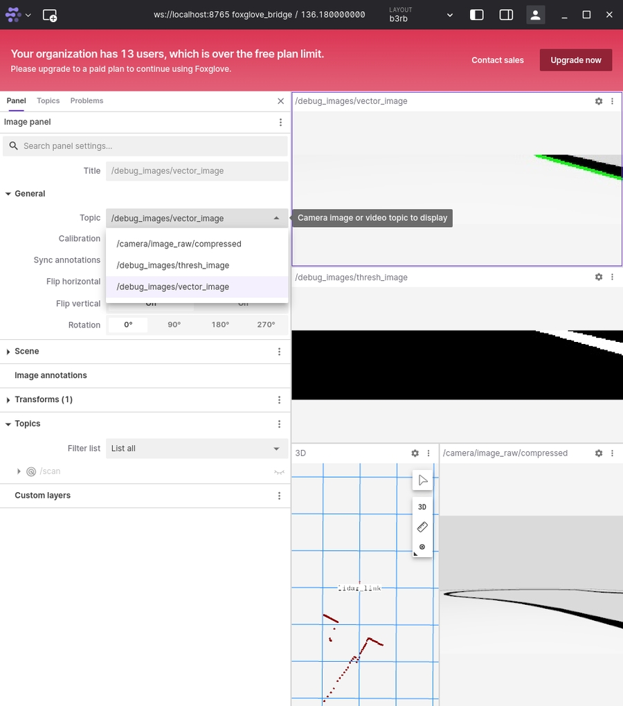

    * Now this panel will display the image whenever you publish a debug image from your code to the said topic.

- **For Lidar Data**

    * Create a new 3D panel by clicking on the add panel button from the top-left corner as shown in the image below:

        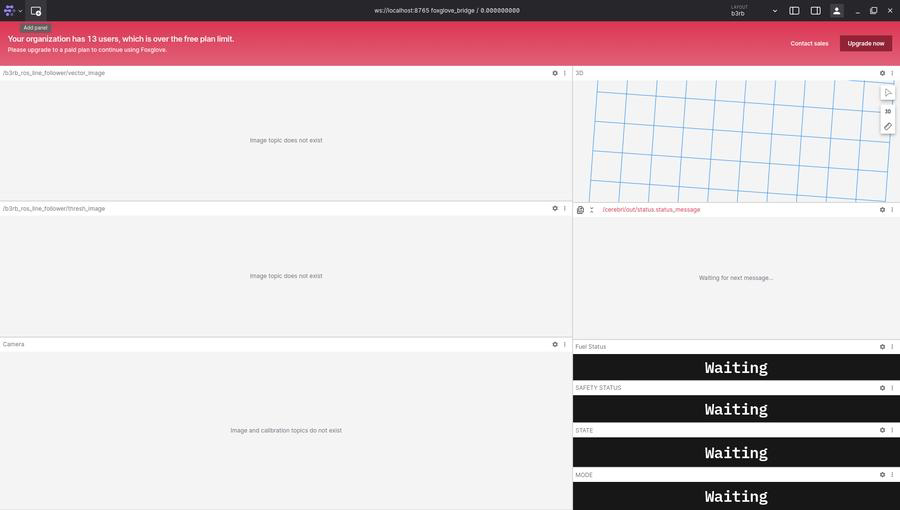

        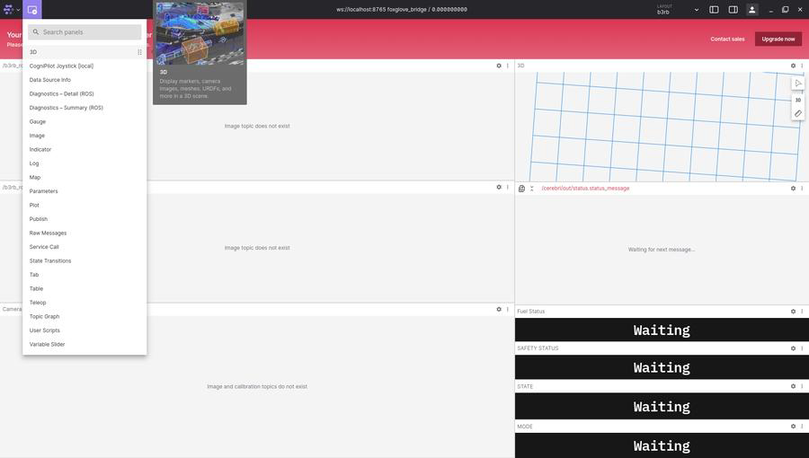

    * You may switch to 2D camera since the LIDAR is 2D.
    
        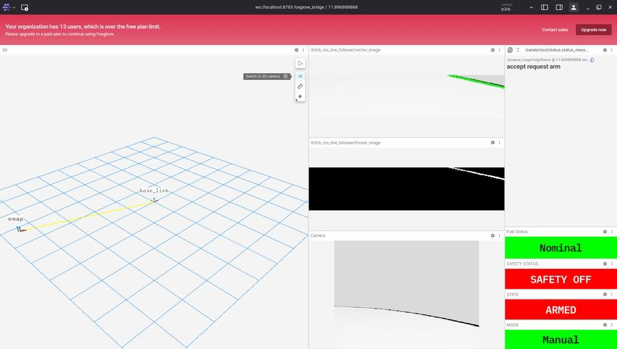

    * Then click on panel settings.

        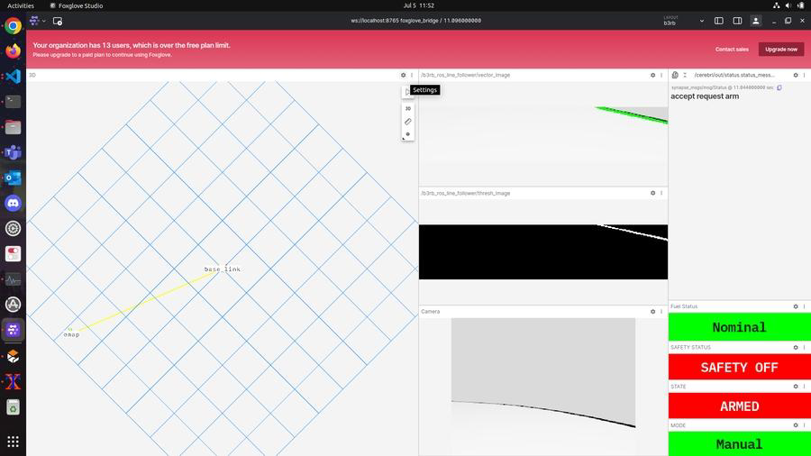

    * Toggle visibility of "/scan" under Topics

        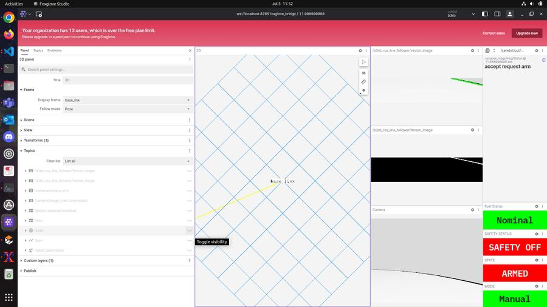

    * Then select "**lidar_link**" in Display frame under Frame.

        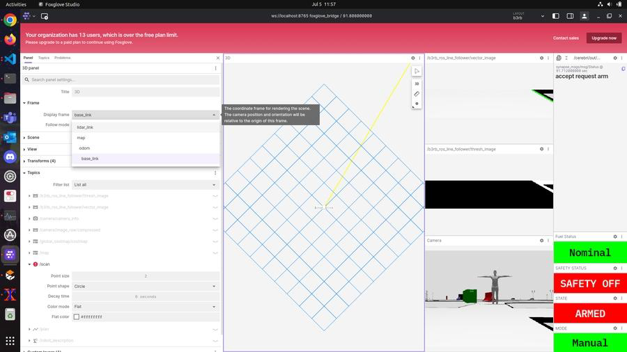

    * If you don't immediately see the "**lidar_link**" option available, then close the settings panel, play the simulation for a few seconds, then try again.

    * You may close the panel settings after this.

    * Please see the attached images for sample output.

        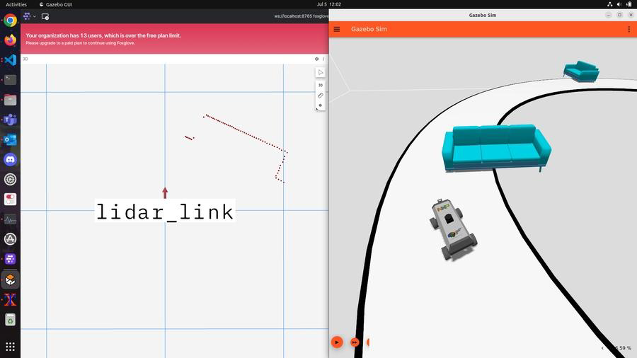
    
        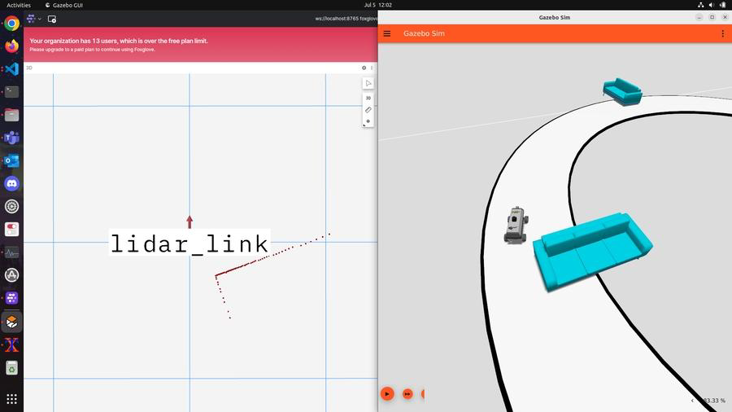
    
        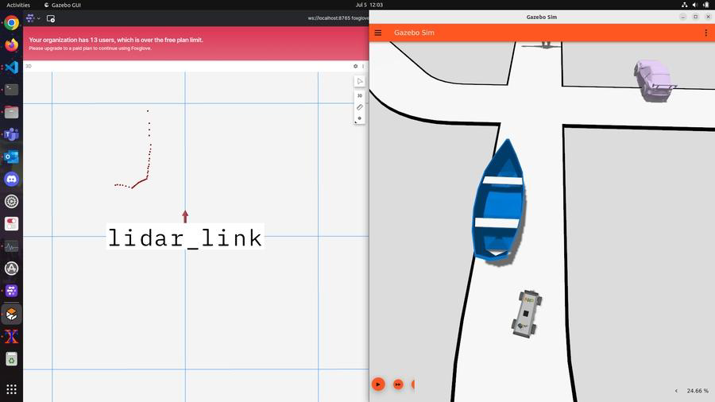
    
        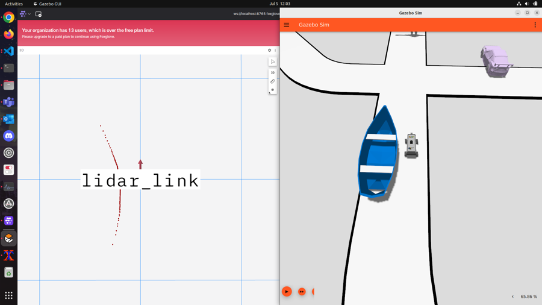

- **Manual Mode**
* For running buggy in Manual mode:
* Click on **Manual** followed by **ARM** buttons.
* After that you may use the joystick to control the buggy.