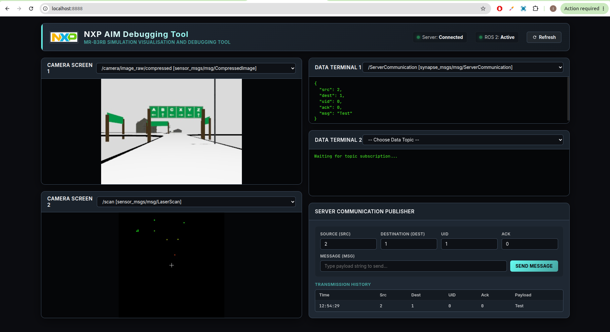

# NXP CUP Debugging Tool
### MR-B3RB Simulation Visualization and Debugging Tool

The **NXP CUP India** team has created a simple, intuitive debugging tool to streamline the development process across all teams. This tool provides a real-time web interface to visualize camera streams, LiDAR maps, and data terminals directly from your buggy.

---

## 🚀 Installation

Follow these quick steps to install the tool on your system:

1. **Download the Debian Package:**
   Ensure you have downloaded the latest `buggy-control-panel.deb` file.

2. **Install the Package:**
   Make sure you already completed installation steps from [Main Readme](README.md)

   Open your terminal in the directory where the package is saved and run:
   ```bash
   cd ~/cognipilot/cranium/NXP_CUP_INDIA_2026/
   sudo dpkg -i buggy-control-panel.deb
   ```

3. **Resolve Missing Dependencies (If Needed):**
   If your system is missing any required dependencies, `dpkg` may throw errors. You can automatically fix and install all missing dependencies by running:
   ```bash
   sudo apt-get install -f
   ```

4. **Complete Installation:**
   After resolving the dependencies, run the installation command once more to complete the setup:
   ```bash
   sudo dpkg -i buggy-control-panel.deb
   ```

---

## 💻 Running the Tool

To launch the dashboard, open your terminal and run:

```bash
buggy-control-panel
```


This will spin up a local server running on port `8888`. You can access the interface by opening your web browser and navigating to:
👉 **[http://localhost:8888/](http://localhost:8888/)**

---

## 🛠 Features & Usage

Using the **NXP CUP Debugging Tool** is straightforward:

* **ROS Topic Selector:** Use the dropdown menus located above the camera screens and data terminals to select any active ROS topic to view its live messages.
* **Dual Visualization Screens:**
  * **Camera Streams:** View real-time visual streams directly from the buggy's cameras.
  * **LiDAR Map:** Generate a real-time LiDAR map from incoming laser scan data. 
    * *Center Cross (`+`):* Represents the location of your buggy.
    * *Colored Dots:* Represent LiDAR hits (detected obstacles).
    * *Dot Color:* Indicates distance (how far an object is from the buggy).
  * 💡 *Pro Tip:* You can create custom topics, publish messages from your buggy's code, and seamlessly visualize the outputs here.
* **Data Terminals:** Monitor textual and structured JSON messages flowing through active topics in real time.
* **Server Communication Simulator:** 
  * Includes a built-in module to simulate server messages on the `ServerCommunication` topic.
  * You can fill out and publish custom messages to test if your buggy correctly parses incoming server instructions and replies with the appropriate acknowledgment (`ack`) messages.
