# NXP India CUP 2026: Autonomous Medical Response

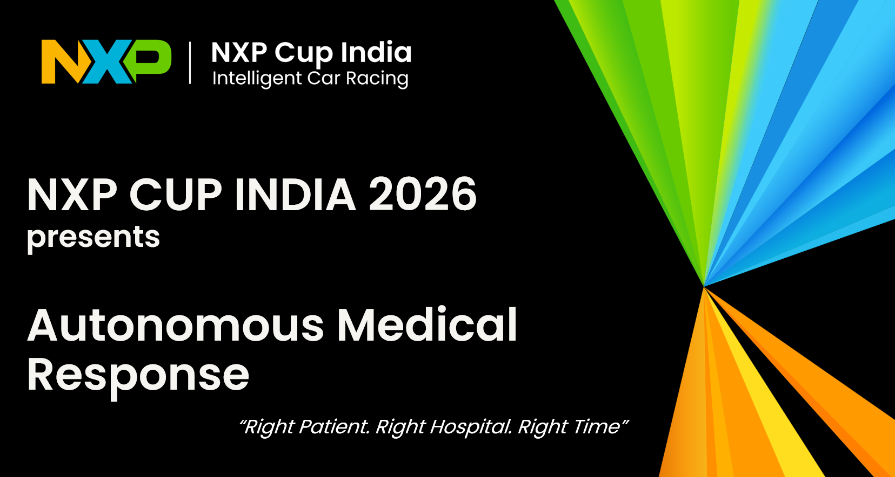

## 📒 Index
* [INTRODUCTION](#introduction)
    * [HARDWARE](#hardware)
    * [SOFTWARE](#software-update)
* [Autonomous Medical Response CHALLENGE DESCRIPTION](#autonomous-medical-response-challenge-description)
    * [SIMULATION WORLD](#simulation-world)
    * [TASK WORKFLOW (PARTICIPANT IMPLEMENTATION)](#task-workflow-participant-implementation)
    * [EVALUATION AND SCORING](#evaluation-and-scoring)
* [Setting up NXP CUP INDIA 2026 Software Stack](#setting-up-nxp-cup-india-2026-software-stack)
    * [PART 1: Setting up Environment](#part-1-setting-up-environment)
    * [PART 2: Setting up the Competition Stack](#part-2-setting-up-the-competition-stack)
    * [PART 3: Understanding the Software Stack](#part-3-understanding-the-software-stack)
    * [PART 4: Build, Modify, Run the Simulation](#part-4-build-modify-run-the-simulation)
* [Submission Rules](#submission-rules)


## **INTRODUCTION**
The NXP Cup 2026 – Autonomous Medical Response Challenge places participants in a realistic smart-city simulation where the NXP buggy acts as an autonomous emergency response vehicle. Participants must develop a complete autonomous solution capable of navigating the NXP Buggy through city roads, interpreting traffic guidance signs, identifying patients, communicating with municipal services, and delivering patients to their assigned hospitals.
The simulated city contains lanes, multiple intersections, buildings, road signs, obstacles, patient locations, hospitals, and decoy facilities. Using onboard sensors and perception algorithms, participants must autonomously travel through the city, locate patient buildings, scan QR codes, obtain hospital assignments from the Municipality Server, and safely transport patients to the correct destinations.
Throughout the challenge, teams will be required to integrate multiple robotics disciplines, including:

* Computer Vision
* Lane Following
* Sign Recognition
* QR Code Detection and Decoding
* Autonomous Navigation
* Mission Planning
* ROS2 Communication
* Obstacle Avoidance
* Decision Making

Successful scoring in the challenge depends on:
* reaching correct destinations 
* making correct navigation decisions
* communicating with external services
* avoiding incorrect deliveries
* and completing all assigned medical response missions within the allotted time.

The ultimate objective is to successfully transport all patients to their assigned hospitals, avoid decoy hospitals and obstacles, exit the city, and autonomously park the buggy in the designated parking area, demonstrating a complete end-to-end autonomous medical response workflow. This is a Time-Bound Challenge.

- The `b3rb_ros_line_follower` folder contains scripts that serve as a foundational ROS 2 nodes.
    * Participants will extend these scripts to implement the full challenge logic.

### **HARDWARE**
This software is designed to run on the Hardware B3RB Buggy or can be tested in compatible Gazebo simulations.
1.  [NXP MR-B3RB](https://nxp.gitbook.io/mr-b3rb): The target hardware buggy.
    * Requires a forward-facing camera for QR code detection and potentially building and sign recognition.
    * Relies on sensors (LIDAR, encoders, IMU) for localization & mapping, and navigation (Nav2).
2.  [Gazebo Simulator](https://gazebosim.org/home): For development and testing in a simulated city environment.
    * The simulation provides a B3RB model with sensors and necessary packages such as NAV2.

### **SOFTWARE**
This project is based on the autopilot project - [CogniPilot](https://cognipilot.org/) (AIRY Release for B3RB).
<br>
Refer the [CogniPilot AIRY Dev Guide](https://airy.cognipilot.org/) for information about it's various components.
<br>

This project includes a ROS2 Python package (b3rb_ros_line_follower) that integrates into Cranium as explained further.

---
## **Autonomous Medical Response CHALLENGE DESCRIPTION**

The primary objective is to maximize points by successfully completing emergency medical response missions across the city in the designated timeline.

### **SIMULATION WORLD**
- **City**
    * The challenge takes place in a simulated smart city consisting of roads, intersections, buildings, sign boards, and obstacles.
    * Participant Buggys must autonomously navigate through the city, complete medical response missions, and safely reach assigned destinations.
    * The city has a dedicated lane network. A buggy must follow the lane discipline at all times.

- **Lane Discipline**
    * The city is surrounded by a Lane Network that can be seen in the simulation as White Road bordered with Blank Line.
    * The black lines detection is to be used the participants to navigate the NXP Buggy within the White Lane.

- **Buildings**
    * The city contains 8 mission-critical buildings, each identified by a QR code.
    * Patient Buildings
        ```
        PATIENT_1
        PATIENT_2
        PATIENT_3
        ```
        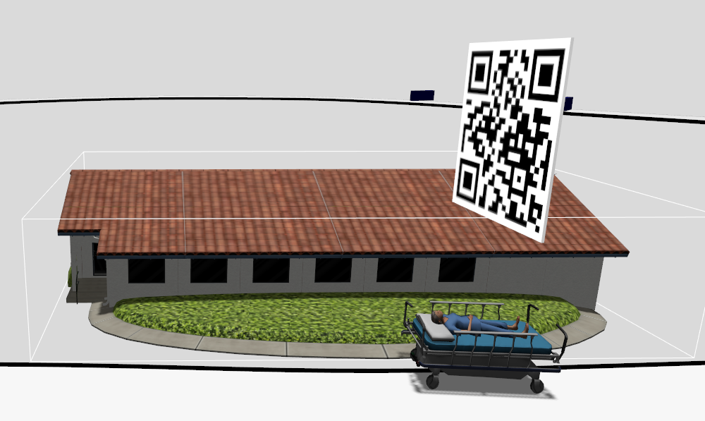
    * Hospital Buildings
        ```
        HOSPITAL_1
        HOSPITAL_2
        HOSPITAL_3
        ```
        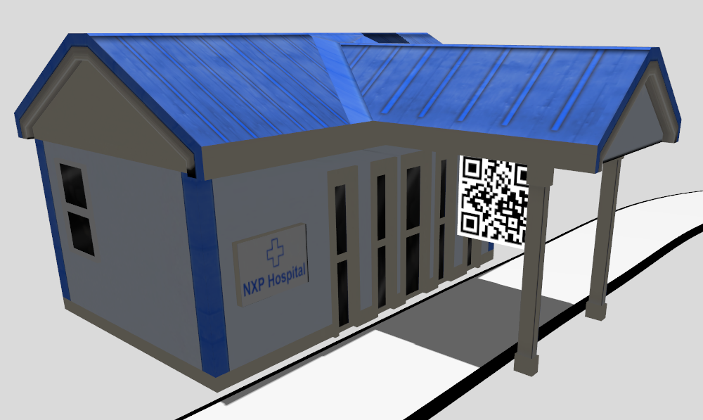
    * Fake Hospital Buildings
        ```
        FAKE_HOSPITAL_1
        FAKE_HOSPITAL_2
        ```
- **QR Codes**
    * Each building contains a QR code that uniquely identifies the building.
    * Participants must detect and decode these QR codes using the onboard camera.
- **Sign Recognition**
    * Road sign boards are placed throughout the city to guide navigation.
    * Each sign board provides directions to:
        * Patient Buildings: A, B, C
        * Hospital Buildings: X, Y, Z

        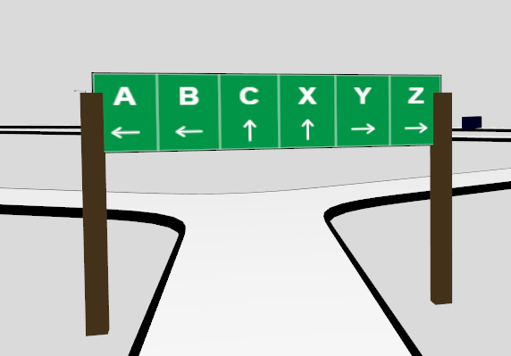
    * Sign to Building Map 
        | Sign  |   Mapping  |
        |-------|------------|
        |   A   |  PATIENT_1 |
        |   B   |  PATIENT_2 |
        |   C   |  PATIENT_3 |
        |   X   | HOSPITAL_1 |
        |   Y   | HOSPITAL_2 |
        |   Z   | HOSPITAL_3 |

    * Possible directions:
        ```
        ← Left
        ↑ Straight
        → Right
        ```
    Participants must interpret these sign boards and take the correct turns to reach their destination.
- **Municipality Server**
    After scanning a patient QR code, participants must send the patient ID to the Municipality Server.
    The server responds with the assigned hospital destination.
    * Example:
        ```
        PATIENT_1    
            ↓
        HOSPITAL_2
        ```

- **Mission Flow (explained in detail below)**
    ```
    Start Buggy
        ↓
    Navigate City
        ↓
    Follow Lane Discipline
        ↓
    Find Patient 1
        ↓
    Scan QR
        ↓
    Contact Municipality Server inside Patient 1 Zone
        ↓
    Receive its Hospital Assignment
        ↓
    Reach Correct 1st Hospital
        ↓
    Acknowledge Server inside Hospital Zone
        ↓
    Get 2nd Patient
        ↓
    Repeat for All Patients
        ↓
    Drop Last Patient
        ↓
    Mission Complete
        ↓
    Bonus Mission
        ↓
    Exit Lane from Front of Last Hospital
        ↓
    Park Vehicle
        ↓
       Stop
    ```
- **Obstacles**
    * The city contains obstacles placed on and around the roads.
    * Participants must avoid collisions while completing all missions within the allotted time.

    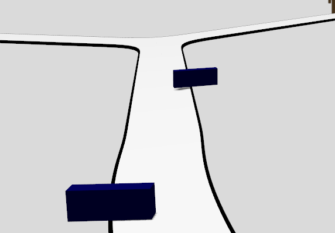

### **TASK WORKFLOW (PARTICIPANT IMPLEMENTATION)**

Participants are responsible for implementing the logic required to successfully complete the emergency response mission.

- **1. Enter the City**
    * Start from the designated launch area.
    * Maneuver the city road network.
    * Begin autonomous operation.
    * Follow Lane Discipline.

- **2. Locate 1st Patient Building**

    * Follow road lanes and sign boards and reach the 1st Patient.
    * Navigate through intersections.
    * In the arena,
        you have 3 patient buildings:
        ```
        PATIENT_1
        PATIENT_2
        PATIENT_3
        ```

- **3. Scan 1st Patient QR Code**

    * Position the buggy near the patient building.
    * Capture and decode the QR code.
    * Extract the patient identifier.
    * Your QR extracts something like this when reading 1st Patient QR:
        ```
        {LOC: PATIENT_1}
        ```

- **4. Contact the Municipality Server**

    * Publish the decoded patient ID to the Municipality Server only when inside Patient Zone.
    * This publishing of Message to Municipality Server must happen only when you are inside Patient building boundaries as seen in the figure.

        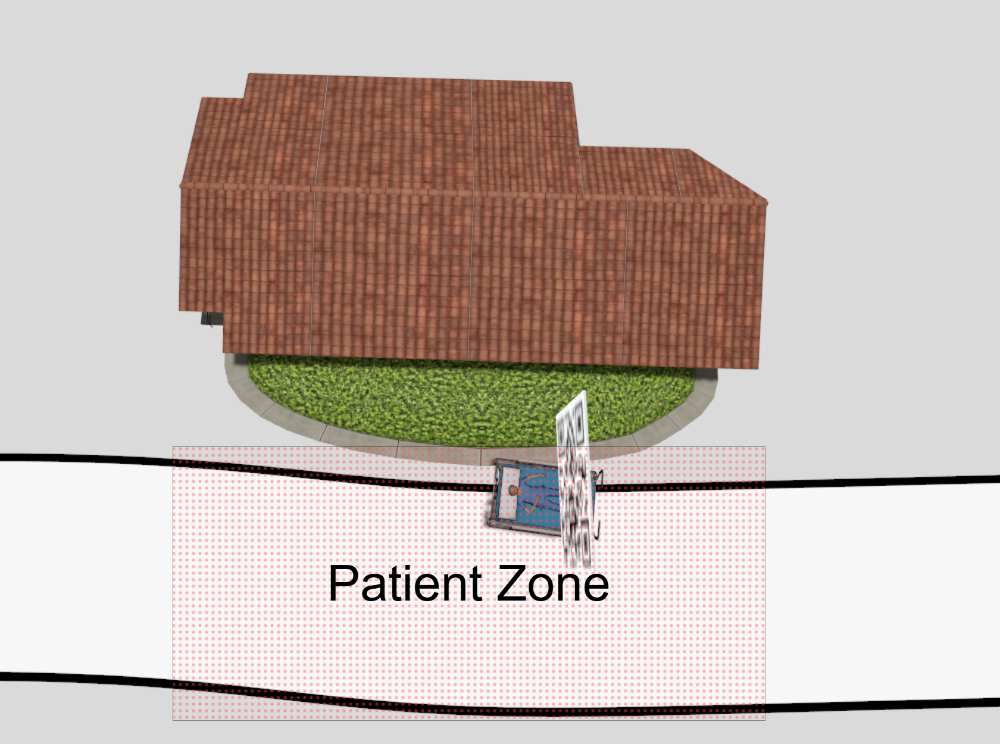

    * This Patient zone will be invisible to you, but are boundary to boundary mapped to a particular building.
    * Wait for the hospital assignment. Do not cross the Patient Zone until Hospital is assigned to you.
    * Walking out of Patient Zone without receiving hospital is a **penalty**.
    
    Example:
    ```
    PATIENT_1   → 
                  Municipality Server
    HOSPITAL_2  ← 
    ```
- **5. Navigate to the Assigned Hospital**

    * Follow the city sign boards.
    * Take the correct turns at intersections.
    * Reach the assigned hospital.
    
    Possible hospital assignments:
    ```
    HOSPITAL_1
    HOSPITAL_2
    HOSPITAL_3
    ```
- **6. Verify Hospital Delivery**

    * Position the buggy near the hospital building
    * Scan the QR code at the hospital building.
    * Verify that the scanned QR matches the hospital assigned by the Municipality Server.
    * If the Scan matches correctly, send the read Hospital to the server inside the Hospital Zone.
    * **If the buggy is in the Hospital wall boundaries and the Hospital is correct, you will receive another Patient**.

        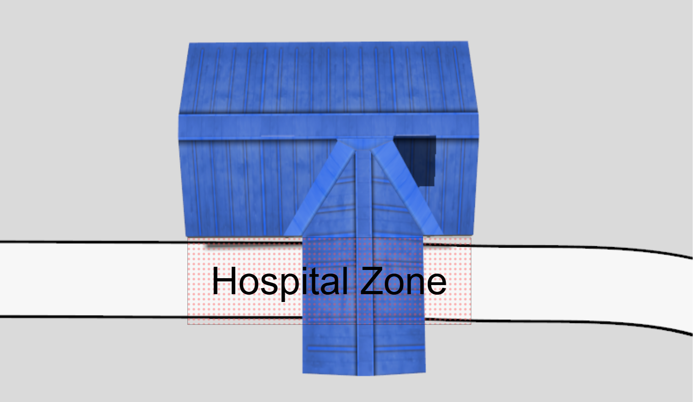
    
    * If you tried to drop the patient(i.e. send Hospital qr scan to Server) outside Hospital Zone that would give you a **Penalty**.

    Example:
    ```
    Assigned : HOSPITAL_2
    Scanned  : HOSPITAL_2
    ```
    ✅ Patient Delivered
    
    Server Sends another Patient only inside Hospital Zone. If not inside Hospital zone, you will receive INVALID msg.
    
    Incorrect deliveries, including arrivals at:
    ```
    FAKE_HOSPITAL_1
    FAKE_HOSPITAL_2
    ```
    will be considered as **Penalties**.

- **7. Repeat for Remaining Patients**

    Continue the process until all patient missions have been completed.
    ```
    PATIENT_2
    PATIENT_3
    ```

- **8. Exit the City Lane**

    After all patient deliveries are completed, navigate towards the city parking.

- **9. Mission Completion**

    **Rule**: The challenge is considered complete immediately after the third patient is successfully delivered to the correct hospital.

    **Timing**: Each Patient has a fair **lifetime** to reach to the hospital, your buggy must reach the Hospitals on time so that the patient does not die. If the Buggy is too slow, The patient dies and its a **penalty**.

- **Bonus Task – Exit and Parking**
    * **Task**: 
        * After successfully delivering the third patient, leave the city through the designated Exit.
        * The Exit is located **in front of** the final hospital delivery zone.
        * Navigate and proceed to that parking area.
        * Once you are inside the parking area, send **PARKED** message to the Municipality Server.
        * The municipality server will wait only for **1-minute** for this parked message.
    * **Bonus Points:**
        * If the Buggy is inside the parking area and
        * the **PARKED** massage is received within a minute of entering parking,
        * Bonus points will be awarded.
    * **Hint:**
        * Even if the Buggy doesn't stop completely but the buggy is inside parking while sending parked message, it is a **Successful parking.**


### **EVALUATION AND SCORING**

- **Evaluation**
    Participants will communicate with the evaluation framework through the designated ROS topics.
    The evaluation system will verify:
    * Correct patient QR code identification.
    * Successful communication with the Municipality Server.
    * Correct hospital assignment handling.
    * Successful delivery to the assigned hospital with-in time.
    * Avoidance of fake hospital deliveries.
    * Completion time.
    * Collision count.
    * Lane Jump count.
    * Bonus exit and parking completion.

    ⚠️ Participants may interact with the Municipality Server multiple times during the mission. However, only successful patient-to-hospital delivery sequences will be considered for scoring.

- **Scoring**
    - **Patient Identification**
        +ve Points for each correctly decoded patient QR code.
        ```
        PATIENT_1
        PATIENT_2
        PATIENT_3
        ```

    - **Municipality Communication**
        +ve Points for each successful patient registration with the Municipality Server.

    - **Hospital Delivery**

        +ve Points for delivering a patient to the hospital assigned by the Municipality Server.

        Example:
        ```
        PATIENT_1
            ↓
        HOSPITAL_2
        ```

    - **Mission Completion Bonus**

        +ve Points for successfully completing deliveries for all three patients.
        ```
        PATIENT_1
        PATIENT_2
        PATIENT_3
        ```

    - **Time-Based Ranking**

        +ve Points awarded percentile-wise based on the total mission completion time.

        The timer stops immediately after the third patient is successfully delivered to the correct hospital.

    - **Collision Penalty**

        -ve Points for every collision with an obstacle or city infrastructure.

    - **Lane Jump Penalty**

        -ve Points for every lane jump i.e. Crossing/Touching the Black Lines each time inside the city infrastructure.


    - **Incorrect Delivery Penalty**

        -ve Points for delivering a patient to the wrong hospital.

        Example:
        ```
        Assigned : HOSPITAL_2
        Reached  : HOSPITAL_1
        ```

    - **Fake Hospital Penalty**

        -ve Points for attempting delivery at a fake hospital.
        ```
        FAKE_HOSPITAL_1
        FAKE_HOSPITAL_2
        ```

    - **Bonus Task Scoring**
        After the third patient delivery, participants may attempt the bonus task.
        * Parking Bonus
            +ve Points for autonomously parking the buggy completely inside the marked parking zone.
    
    **The winner will be the team with the highest final score.**

    **In the event of a tie, the team with the lower mission completion time will be ranked higher.**

    > ⚠️ [NOTE]
    > The exact scoring number is decided by NXP CUP Team and is a discrete autonomous evaluation software.

---
## **Setting up NXP CUP INDIA 2026 Software Stack (Installation Guide)**

Guide to install setup for NXP CUP 2026 CHALLENGE.

**Requirements:**
1. [Ubuntu 22.04.5](https://releases.ubuntu.com/jammy/) (Fresh installation recommended to prevent any compatibility conflict with current setup)
2. Unrestricted internet (Official network such as college wifi is not recommended; use personal internet)

**General Guidelines**
1. Press `Y` and `enter` wherever necessary.
2. Enter **sudo password** wherever necessary.

Run the commands in code boxes (like the following) in the terminal window.
```
sudo apt install git
```

In case the installation or setup gets corrupted, run the following to clean the entire system: <br>
**(⚠️ ALERT: This is a nuclear option, will delete the whole setup and should be used carefully.)**
```
sudo apt-get remove gz-garden
sudo apt-get remove ros-humble-ros-gzgarden
sudo apt-get remove gz-harmonic
sudo apt-get remove ros-humble-ros-gzharmonic

sudo rm -rf /opt/toolchains
sudo rm -rf /opt/zeth
sudo rm -rf /opt/poetry
rm -rf ~/bin/build_*
rm -rf ~/bin/west
rm -rf ~/bin/cyecca
rm -rf ~/bin/docs
rm -rf ~/cognipilot
```

### **PART 1: Setting up Environment**

**Install CogniPilot by executing the following steps:
    (these steps are taken from [https://airy.cognipilot.org/getting_started/install/](https://airy.cognipilot.org/getting_started/install/)):**
1. NOTE:
    1. docker method is **not** recommended
    2. SSH and GPG keys are **not** required
2. Use CogniPilot universal installer: Open a terminal and run the following.
    ```
    sudo apt-get update
    sudo apt-get install git wget -y
    mkdir -p ~/cognipilot/installer
    wget -O ~/cognipilot/installer/install_cognipilot.sh https://raw.githubusercontent.com/CogniPilot/helmet/main/install/install_cognipilot.sh
    chmod a+x ~/cognipilot/installer/install_cognipilot.sh
    /bin/bash ~/cognipilot/installer/install_cognipilot.sh
    ```
    1. Select `1` (airy) when asked for 'release'
    2. Select `1` (native) when asked for 'installer type'
    3. If you are asked "Do you want to continue" then select `Y` and press enter
    4. Select `n` (No) when asked for 'ssh keys'
3. Build the workspace: Open a terminal and run the following.
    ```
    source ~/.profile
    source ~/.bashrc
    build_workspace
    ```
    1. select `n` (No) "for use ssh keys"
    2. select `1` (b3rb) "for platform"
4. Source ~/.bashrc.
    ```
    source ~/.bashrc
    ```
5. Build Foxglove Studio. Understand from Internet what it is, you'll learn something amazing!!
    ```
    build_foxglove
    ```
    1. select `n` (No) when asked for 'ssh keys'
    2. select `1` (airy) when asked for 'release'

### **PART 2: Setting up the Competition Stack**

Perform the following steps to setup the environment and build cranium for NXP CUP INDIA 2026:

> **DO THESE STEPS VERY CAREFULLY AND RESPONSIBLY !!!**

1.  **Install Dependencies:** (The following modules are allowed for use in your solution.)
    - **ALERT: If you wish to use an additional python module, refer "[SUBMISSION RULES](#submission-rules)" below**
    ```bash
    pip install \
        torch==2.3.0 \
        torchvision==0.18.0 \
        numpy==1.26.4 \
        opencv-python==4.11.0.86 \
        scipy==1.15.1 \
        scikit-learn==1.5.2 \
        tk==0.1.0 \
        pyzbar==0.1.9 \
        matplotlib==3.5.1 \
        pyyaml==6.0.2 \
        tflite-runtime==2.14.0
    ```

2.  **Setup Environment:**
    ```
    cd ~/cognipilot/cranium/
    rm -rf src install log build
    ``` 
    
    ```
    git clone https://github.com/NXP-Robotics/NXP_CUP_INDIA_2026.git
    mv NXP_CUP_INDIA_2026/src .
    ```

### **PART 3: Understanding the Software Stack**
> Advisory note: First read and understand it, be not in a hurry to edit the tech stack.

3. **Understanding Folders**

    * **src folder**: The ~/cognipilot/cranium/src folder contains 12 folders out of which 2 folders are of your main interest.
        * b3rb_ros_line_follower
        * dream_world
        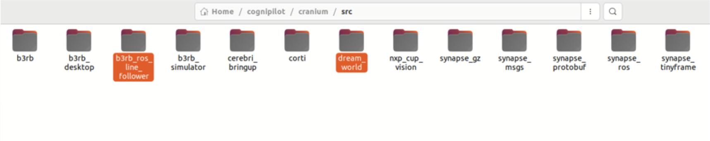

    * **Models**
        * Every 3d model that you need to spawn is already available in the **src/dream_world** folder.
        * Inside **src/dream_world/dream_world/models**, you will find many ready made models.
        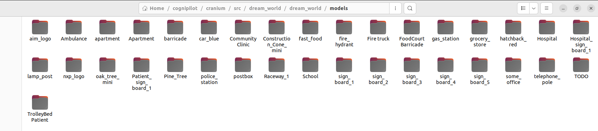
        * Try opening **Raceway_1.sdf** in **src/dream_world/dream_world/worlds**
        * We add/subtract models to be spawned in Simulation from this file.
        * Initial lines in this file are the environment settings and then start Models.
        * Only models that are present in **src/dream_world/dream_world/worlds** directory can be included into the simulation by this method.
        * Example:
          ```
          <include>
            <uri>models://Raceway_1</uri>
            <name>track</name>
            <pose>0 2.245 0 0 0 1.55</pose>
          </include>
          ```
          * **include**: This tag will contain information about one unique instance of any model spawned in simulation. Make sure to always have end tag as well, when using this ("include").
          
          * **uri**: This tag will contain name/type of the model to be spawned into the simulation. This represents the name of the desired model that has to be spawned and is stored either in ~/cognipilot/cranium/src/dream_world/dream_world/models* .
          
          Please make sure the name of the model passed to the "URI tag" parameter must be case sensitive as well as present in the mentioned folder.
          
          * **name**: It is a custom unique identifier given to each entity which allows Gazebo to keep track of each model spawned into the simulation.
            Use unique string values for the "name" parameter for each obstacle to be added. As same value will not spawn the obstacles into simulation
          
          * **pose**: This parameter defines the position and orientation of models in simulation. rIt is represented by "x y z R P Y" where: x is x-coordinate, y is y-coordinate, z is z-coordinate, R is roll, P is pitch and Y is yaw.

    * **B3RB ROS LINE FOLLOWER**
        > Advisory note: **~/congnipilot/cranium/src/b3rb_ros_line_follower** is the only folder that the participants have to modify an submit for the Regional Finale

        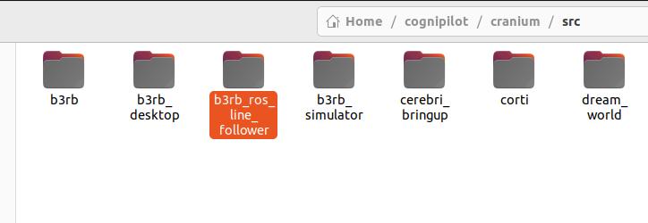

        To understand this package deeply, refer to [B3RB ROS 2 Package](B3RB_ROS2_Package.md)


### **PART 4: Build, Modify, Run the Simulation**

There is a simulation world environment **Raceway_1** which you can load for your testing.

Perform the following steps:

4.  **Build Workspace and Launch Gazebo Simulation:**

    NOTE: Whenever you make a change, `colcon build` and `source setup.bash` is required as follows.

    * Open a **new** terminal and follow the following steps for building Cranium and running Gazebo Simulation.
        ```
        cd ~/cognipilot/cranium/
        colcon build
        ```

        It will start building 16 packages. Once building is complete, start **fresh** terminal.
        In case you face any error in colcon build, this means **src** folder is not right, follow from **Setup Environment** again.
        ```
        source ~/cognipilot/cranium/install/setup.bash
        ros2 launch b3rb_gz_bringup sil.launch.py world:=Raceway_1
        ```
        Running this will launch the gazebo simulation and Xterm window as follows:
        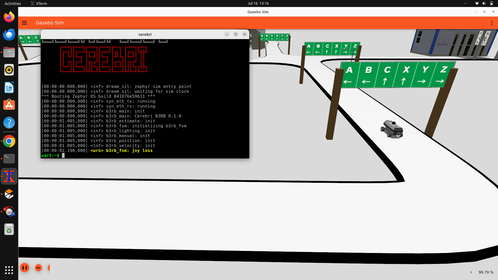

        > 💡 **Tip:** Use mouse with your system for better scroll experience in Gazebo.

        > 📢❗🚨 **NOTE** The empty world that you are seeing is a sample world, the Regional Finale world is different but has the same logic to win🎯.

    **Run individual nodes in separate fresh terminals**:
    *   **Lane Vector Extractor**:
        ```
        source ~/cognipilot/cranium/install/setup.bash
        ros2 run b3rb_ros_line_follower vectors
        ```
    *   **Sign Board Classifier**:
        ```
        source ~/cognipilot/cranium/install/setup.bash
        ros2 run b3rb_ros_line_follower detect
        ```

        > In case you face any Tensorflow Error:
        > ```
        > sudo pip install tensorflow
        > ```
        > Check if installed:
        > ```pip show tensorflow
        > This show the tensorflow version

    *   **QR Scanner Node**:
        ```
        source ~/cognipilot/cranium/install/setup.bash
        ros2 run b3rb_ros_line_follower qr_detect
        ```
    
    *   **Runner Node**.
        ```
        source ~/cognipilot/cranium/install/setup.bash
        ros2 run b3rb_ros_line_follower runner
        ```

    *Running the above 4 commands should make the buggy move autonomously now in simulation.*

    If on execution of any _ros2 run b3rb_ros_line_follower gives error like below, it means that sourcing of setup.bash was unsuccessful
    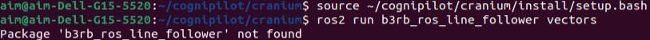

5. **Updating the Code Base for NXP CUP INDIA 2026 Challenge:**

    > **💡Tip**: First build the empty sample world successfully.

    * **Adding Obstacles**:
        * The folder you received spawns an empty sample track.
        * Uncomment the models as explained above one-by-one in **Raceway_1.sdf** file to spawn them for your circuit during your testing.
        * Build and Load the sample world again as mentioned here: [Build Workspace](#part-4-build-modify-run-the-simulation)
        * This loads your world with obstacles.
    
    * **B3RB ROS LINE FOLLOWER**
        * This is the only folder that the participants have to modify and submit for the Regional Finale
        * Update your code in this folder only and run for iterations.
        * Complete your logic inside this to complete the challenge.
        * Build and Load the sample world again as mentioned here: [Build Workspace](#part-4-build-modify-run-the-simulation)

6. **Communication with the Municipal Server**

    Refer to [Server Communication Guide](ServerCommunicationGuide.md)

7.  **NXP CUP Debugging Tool**

    NXP provides a great debug tool. Read here: [NXP CUP Debugging Tool](NXP_CUP_DebuggingTool.md)

## **SUBMISSION RULES:**

1. **NXP laptop** will be used for evaluation. No additional package installation will be allowed.
2. The code should work with the default setup created at the time of installing CogniPilot Airy release.
3. Additional python modules may be permitted only after written consent from the NXP CUP TEAM.
    - Contact NXP CUP Technical Team if you wish to use a python module not in the following list:
        - torch==2.3.0
        - torchvision==0.18.0
        - numpy==1.26.4
        - opencv-python==4.11.0.86
        - scipy==1.15.1,
        - scikit-learn==1.5.2
        - tk==0.1.0
        - pyzbar==0.1.9
        - matplotlib==3.5.1
        - pyyaml==6.0.2
        - tflite-runtime==2.14.0.

4. Participants need to submit 'b3rb_ros_line_follower' folder only:

    Create a new folder with name: NXP_CUP26_<your_team_id>:
    ```
        If you team id is: '3124'
        the folder name is **NXP_CUP26_3124**.
        Place the 'b3rb_ros_line_follower' folder inside it.
    ```

    Zip this folder and its name should be: 
    ```
        NXP_CUP26_<your_team_id>.zip
    ```

    This is the final submission file. The place to upload this file will be communicated via **Teams Channel**. 

5. NXP Team **may** ask for the Video Submissions too if the number of participants exceed the threshold.
    
    The process of submitting the video will be communicated via **Teams channel**.

6. The submission of folder and video will communicated via the **Teams Channel**.
